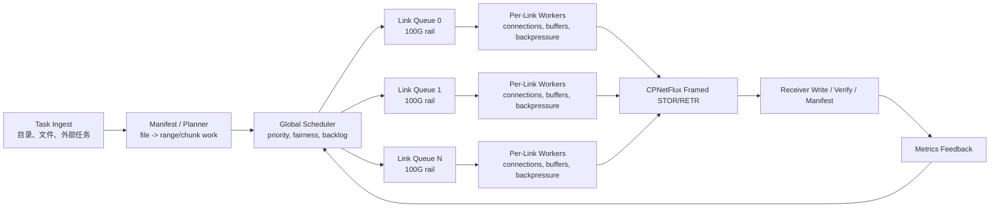

# 并发传输调研报告：从多连接到全局多任务/多链路调度

日期：2026-08-03  
项目：CPNetFlux Beta  
性质：调研与讨论文档，尚不是最终实现设计稿

## 0. 摘要

并发传输不是简单地把 `connections` 调大，也不是把一个文件切成更多块就一定能跑满链路。对于 100G 乃至 10 条 100G 链路组成的并行传输系统，真正的问题是：网络、存储、CPU、校验、压缩、控制面、恢复语义和任务调度是否能形成一个持续供给数据的流水线。

对 CPNetFlux 当前代码和文档的判断如下：

- CPNetFlux 已经具备良好的单文件多连接基础：offset-aware chunk frame、每条 TCP 连接独立发送 chunk、接收端按 offset 写入、manifest/verified_chunks 作为恢复事实源。
- 目录传输已经有 file-level bounded scheduler：`--file-parallelism` 控制同时处理的文件数；`--control-reuse worker` 可以复用每个 worker 的控制连接，适合减少小文件场景的控制面开销。
- 现有能力仍不是“全局多任务/多链路调度器”：它还没有 link/rail 抽象，没有跨任务的统一 backlog，没有把多个文件、多个 range、多个物理链路和每条链路内部连接池放在同一个调度模型里。
- 自适应压缩如果进入热路径，会和“尽量保持物理链路高利用率”产生张力。压缩可以减少传输完成时间，但可能降低物理链路字节占用率；如果压缩速度或压缩后产出速率不足，发送侧会缺数据，链路反而空闲。
- 下一步更合理的方向不是先把压缩放进主路径，而是先做“raw-first、work-conserving”的全局调度模型：只要链路可写，就优先保证有 raw chunk 可发；压缩结果只作为 opportunistic ready work 参与调度，不能阻塞裸传输。

一句话概括：CPNetFlux 下一阶段的核心不是“更多连接”，而是“让每条物理链路始终有足够正确、可恢复、可观测的数据任务可做”。

## 1. 并发传输到底在解决什么

高性能传输的目标通常不是让某个线程跑得更快，而是让整个端到端流水线的最慢环节尽量靠近物理上限。一个传输系统可以抽象成：

```text
source storage -> read -> checksum/compress/pack -> send -> network ->
receive -> verify/decompress -> write -> manifest/commit
```

端到端吞吐大致受以下公式限制：

```text
T_effective = min(
  T_source_read,
  T_transform,
  T_checksum,
  T_sender_pack,
  T_network,
  T_receiver_unpack,
  T_dest_write,
  T_manifest_commit
)
```

这里的关键是 `min(...)`。如果目标链路是 100G，即理论线速约 12.5 GB/s，那么只要任意一个环节低于 12.5 GB/s，网络就无法被持续喂满。实际应用层吞吐还要扣除 TCP/IP/Ethernet、TLS、frame header、系统调用、调度、内存拷贝等开销，所以项目文档中把 100G 文件传输目标写成端到端大约 11 GB/s 是合理的工程口径。

当扩展到 10 条 100G 链路时，线速合计约 1 Tb/s，即 125 GB/s。此时单机 CPU、内存带宽、PCIe、NUMA、NVMe 或并行文件系统都会进入核心瓶颈范围。软件层面能做的不是凭空创造硬件吞吐，而是减少软件空转、减少无效等待、把任务均匀地分布到可用链路和硬件资源上。

## 2. 基本概念

### 2.1 并发、并行、流水线、分片

| 概念 | 含义 | 在文件传输里的例子 | 主要价值 |
| --- | --- | --- | --- |
| 并发 concurrency | 多个任务在时间上重叠推进 | 多个文件同时传，多个连接同时打开 | 隐藏等待，减少空闲 |
| 并行 parallelism | 多个任务真正同时执行 | 多核同时 read/checksum/send | 提高总处理能力 |
| 流水线 pipelining | 上一阶段处理 chunk A 时，下一阶段处理 chunk B | read、checksum、send、write 分阶段排队 | 避免阶段之间互相等待 |
| 分片 striping/ranging | 把数据按 offset 切分给多个执行单元 | 一个大文件切成多个 range/chunk | 避免单流、单线程、单磁盘成为瓶颈 |
| 多链路 multi-rail | 多个 NIC/路径/链路并行承载同一批任务 | 10 条 100G 链路各自有发送队列 | 聚合物理带宽 |

这些概念经常被混用，但设计时必须分开。`--connections 16` 主要解决的是“单文件多 TCP stream 并发”；`--file-parallelism 8` 主要解决的是“目录内多个文件并发”；多链路调度解决的是“哪些任务应该进入哪条物理链路，以及每条链路内部开多少并发”。

### 2.2 物理链路利用率、应用吞吐和有效吞吐

讨论压缩和调度时，要区分三个指标：

| 指标 | 口径 | 例子 |
| --- | --- | --- |
| 物理链路利用率 | 网卡实际发出的 wire bytes / 链路线速 | 100G 链路跑到 90G wire throughput |
| 应用逻辑吞吐 | 原始数据大小 / 任务完成时间 | 100GB 原始数据压缩后 20GB，20 秒完成，逻辑吞吐 5GB/s |
| 有效吞吐 goodput | 被接收端接受、校验通过、最终提交的数据 / 时间 | 去掉重传、协议开销、失败 chunk 后的有效进度 |

用户当前明确的目标是“尽量保持物理链路高利用率”。这意味着调度器不能只追求“压缩后少传一点、任务更快结束”，还要保证每条链路上持续有数据发送。对于科学数据压缩，这会影响策略：压缩应服务于总体任务完成和 CPU/存储压力缓解，但不能让主发送路径等待压缩。

## 3. 为什么高带宽场景需要并发传输

### 3.1 BDP：链路越快，飞行中的数据必须越多

BDP，即 Bandwidth Delay Product，表示为了填满链路，网络中至少需要有多少未确认数据：

```text
BDP = bandwidth * RTT
```

几个直观数值：

| 链路 | RTT | BDP |
| --- | ---: | ---: |
| 100G | 1 ms | 约 12.5 MB |
| 100G | 10 ms | 约 125 MB |
| 100G | 50 ms | 约 625 MB |
| 10 x 100G | 1 ms | 约 125 MB |
| 10 x 100G | 10 ms | 约 1.25 GB |

如果发送端的 socket buffer、应用层 pending queue、chunk 队列或接收端写入能力不足，链路就会出现“发一阵、等一阵”的锯齿状吞吐。并发传输的第一层意义，就是提供足够的 in-flight bytes。

### 3.2 单 TCP 流经常不是上限的好代理

单 TCP 流会受拥塞窗口增长、丢包恢复、内核调度、socket buffer、单核处理能力、网卡队列映射等影响。多连接可以把负载分散到多个 socket、多个队列和多个 CPU 核上，同时提高总 in-flight bytes。

但多连接不是越多越好。连接数过高会带来：

- 上下文切换和锁竞争增加。
- TCP 公平性和队列竞争变差。
- 接收端乱序写入压力上升。
- manifest/checksum 元数据提交压力上升。
- 小 chunk 太多导致 header、系统调用和调度开销占比变高。

因此高性能传输通常需要“自适应并发度”：在吞吐不再提升、重传/CPU/写等待开始上升时停止增加连接，甚至降低连接数。

### 3.3 小文件和大文件是两类问题

大文件的主要问题是链路、存储和 CPU pipeline 是否持续饱和。小文件的主要问题是固定开销占比太高，例如：

- 控制连接建立和认证。
- 每个文件的 STOR/RETR 命令往返。
- 文件 open/close/rename。
- manifest 初始化和提交。
- 目录扫描、路径校验和状态记录。

所以小文件场景通常更需要 file-level concurrency、控制连接复用、批量元数据处理和小文件聚合；大文件场景更需要 range-level 并发、per-link 队列和稳定的大块流水线。

## 4. 并发传输的分层模型

可以把并发能力分成六层。越往下越接近 socket 和硬件，越往上越接近任务调度和用户语义。

### 4.1 单文件连接级并发

一个文件被切成多个 chunk/range，多个 TCP 连接同时发送不同 offset 的数据。接收端按 offset 写入临时文件，最后校验并 rename 提交。

优点：

- 实现相对直接。
- 适合大文件。
- 能突破单 TCP 流限制。
- 和断点续传的 missing range 语义天然兼容。

风险：

- 接收端随机写或乱序写压力增加。
- chunk 过小会放大元数据和系统调用开销。
- 单文件的 chunk plan 如果静态分配，慢连接会拖尾。

### 4.2 chunk/range 级动态调度

静态 chunk plan 是把 chunk 预先平均分给每条连接；动态调度则是连接空闲时从共享队列取下一个 range。

动态调度更适合异构环境：

- 某条连接变慢时，其他连接可以继续取任务。
- 某条链路丢包或拥塞时，不会长期拖住一段固定 range。
- 可以根据 chunk 大小、文件类型、压缩状态、优先级做调度。

但动态调度要求恢复语义更严谨：每个 range 必须是幂等的，完成状态必须由接收端校验后的 manifest 记录，而不是由发送端“认为发完了”来决定。

### 4.3 文件级并发

目录传输中，多个文件可以同时传。对小文件而言，这通常比给单个小文件开多连接更有效。

文件级并发适合：

- 大量小文件。
- 混合大小文件。
- 有些文件被压缩、预处理或校验拖慢时，其他文件仍可继续占用链路。

文件级并发的关键是 bounded queue：不能让几万个文件同时打开 fd，也不能让每个文件都独立开满连接，否则会把 fd、内存和控制面打爆。

### 4.4 任务级并发

如果未来 CPNetFlux 服务的不只是“一次目录传输”，而是多个数据集、多用户、多任务队列，调度单位就不能只停留在当前命令行的一棵目录树。全局任务级调度器需要理解：

- 不同任务的优先级。
- 不同任务的数据量和文件结构。
- 每个任务是否允许压缩。
- 每个任务是否可以跨链路传。
- 失败后如何恢复和重排。

这是从“传输工具”走向“传输底座”的关键一步。

### 4.5 链路级并发：multi-rail

当系统有 10 条 100G 链路时，调度器必须把每条链路视为有容量、有状态、有队列的资源，而不是让操作系统路由表自己解决所有问题。

一个 link/rail 抽象至少需要包含：

- 绑定的本地 IP、网卡或路由策略。
- 对端地址或对端入口。
- 标称带宽，例如 100G。
- 当前 wire throughput。
- 当前 active streams。
- 当前发送队列长度和低水位事件。
- 错误率、重传、RTT、发送阻塞时间。
- NUMA/CPU 亲和性建议。

多链路调度的目标不是平均分配 chunk 数，而是让每条链路按容量持续工作。例如 10 条链路中 8 条健康、2 条拥塞时，调度器应把新任务倾向分配给健康链路，而不是机械地轮询。

### 4.6 流水线级并发

即使网络调度合理，发送路径也可能被 read、checksum、compression、copy 或 write 卡住。流水线级并发关注每个阶段之间的队列：

```text
read queue -> transform queue -> send queue -> ack/verify queue -> commit queue
```

理想状态是每个阶段都有少量但足够的 backlog。队列太空说明下游缺数据，链路可能闲置；队列太满说明下游处理不过来，内存和延迟会上升。

## 5. 典型系统和工程经验

### 5.1 GridFTP / Globus

GridFTP 的核心经验是：科学数据传输不能只依赖传统 FTP 的单连接模型。它引入并强化了并行数据流、partial transfer、restart、第三方传输、数据通道安全等能力。Globus 后续把这些能力进一步产品化，重点放在端点、任务、可靠传输、自动重试和用户体验上。

对 CPNetFlux 的启发：

- 兼容 FTP/GridFTP 风格控制面是合理入口，但不必复刻完整 GridFTP Mode E。
- 数据面可以自研，只要保持 offset/range、restart、checksum 和状态机语义清晰。
- “可靠完成”与“高吞吐”同等重要；高性能系统不能只看一次成功样本。
- 端点级、任务级、调度级能力往往比单次 socket 调参更决定生产体验。

### 5.2 FDT

FDT，即 Fast Data Transfer，是面向大规模数据传输的工具，强调使用多个 TCP stream、NIO/buffer、自动协调和高吞吐。它的价值不只是“多连接”，而是把应用层 buffer、socket 写入和传输控制组合成持续的数据泵。

对 CPNetFlux 的启发：

- 多连接需要配套 buffer 管理和 backpressure，而不是线程随意读写。
- 发送侧要尽量保持 ready-to-send 数据。
- 内存到内存基线很重要，必须先证明网络路径能跑高，再把文件 IO 加回来。

### 5.3 bbcp

bbcp 是高性能远程拷贝工具，长期用于科学计算环境。它支持多 stream、窗口和 buffer 调整，常作为传统 `scp`/`rcp` 不够快时的替代方案。

对 CPNetFlux 的启发：

- CLI 参数里的 stream/window/buffer 是性能调优入口，但生产系统需要把这些调优自动化。
- 并发度和 socket buffer 必须结合链路 RTT、丢包、CPU 和存储来判断。
- 工具级高性能可以先靠参数，但平台级底座最终需要调度器。

### 5.4 ESnet DTN / Science DMZ

ESnet 的 Fasterdata 和 Science DMZ 经验强调：100G 级传输是系统工程。Data Transfer Node 通常需要专门的硬件、内核参数、网卡配置、文件系统、监控和端到端测试路径。perfSONAR、iperf3、fio、NIC counters 等基线工具不是附属项，而是判断瓶颈位置的前置条件。

对 CPNetFlux 的启发：

- 云服务器 10M 带宽只能做正确性、稳定性和调度逻辑验证，不能证明 100G readiness。
- 100G 优化必须先分层：network-only、memory-to-memory、file-to-file、checksum-on/off、compression-on/off。
- 如果 iperf3/fio 基线达不到目标，CPNetFlux 应避免背锅；报告中必须区分硬件瓶颈和软件瓶颈。

### 5.5 近五年相关论文脉络

严格来说，近五年顶会里“直接以 GridFTP 式并发文件传输协议”为主题的论文并不多。这个方向的研究已经从早期的“单个传输工具如何调 `parallelism/concurrency/pipelining`”逐步转向三类问题：第一类是自动调参和任务调度，例如 SC 2021 的 [Falcon: Online Optimization of File Transfers in High-Speed Networks](https://dl.acm.org/doi/10.1145/3458817.3476164) 和 ICS 2023 的 [Marlin: Use Only What You Need: Judicious Parallelism for File Transfers Over High Performance Networks](https://dl.acm.org/doi/10.1145/3577193.3593722)。这类工作和 CPNetFlux 最贴近，它们的核心判断是：并发度不是固定参数，而应该由文件大小、RTT、端点能力、历史吞吐和当前争用共同决定；过度并行会浪费 CPU、socket、队列和存储资源，甚至降低总体完成时间。因此，CPNetFlux 后续把 `connections` 从用户手工旋钮变成调度器输出，是符合近年研究趋势的。

第二类是大规模托管传输系统和云上 overlay。SIGCOMM 2024 的 [Effingo: Throughput-oriented, Large-scale, Managed Data Transfers](https://dl.acm.org/doi/10.1145/3651890.3672262) 很重要，因为它研究的不是单次拷贝，而是大规模服务每天如何管理海量数据搬迁；NSDI 2023 的 [Skyplane](https://www.usenix.org/conference/nsdi23/presentation/yang-zongheng) 和 NSDI 2024 的 [Cloudcast](https://www.usenix.org/conference/nsdi24/presentation/zhang-qizhen) 则说明，在多云、多区域、多路径场景下，传输系统需要把吞吐、成本、路径和中转节点一起优化。这些论文对 CPNetFlux 的启发是：如果未来有 10 条 100G 链路，系统不应把它们看成“更多 socket”，而应看成有容量、有价格、有故障率、有反馈信号的调度资源。全局调度器必须有 link/rail state、ready backlog、per-link queue 和反馈闭环。

第三类是 WAN 流量工程、拥塞控制和科学数据压缩。SIGCOMM/NSDI 近年的 TE 工作，例如 [Teal](https://dl.acm.org/doi/10.1145/3603269.3604831)、[BLASTSHIELD](https://www.usenix.org/conference/nsdi22/presentation/zhang-qizhen) 等，虽然不是文件传输协议论文，但它们强调“集中或半集中控制器 + 运行时反馈 + 快速重优化”的模式，这正是多链路调度需要借鉴的控制结构。科学数据方向，ICDCS 2023 的 [Ocelot: Optimizing Scientific Data Transfer on Globus with Error-bounded Lossy Compression](https://ieeexplore.ieee.org/document/10272436) 则直接提醒我们：压缩能降低传输字节量，但必须进入端到端优化模型，不能只看压缩率。对 CPNetFlux 而言，这支持前文提出的 raw-first + opportunistic compression：压缩结果可以成为调度器的 ready work，但不应阻塞物理链路。

### 5.6 奠基论文脉络

奠基工作基本回答了三个问题：为什么需要应用层并发，为什么需要可靠的传输状态机，以及为什么 100G 不是纯软件问题。最早一批工作包括 SC 2000 的 [PSockets: The Case for Application-level Network Striping for Data Intensive Applications using High Speed Wide Area Networks](https://dl.acm.org/doi/10.1145/370049.370432)。它把多路径/多连接 striping 放到应用层讨论，说明单 TCP 流和单路径抽象不足以承载数据密集型广域传输。GridFTP 系列工作进一步把这个思想系统化：[GridFTP: Protocol Extensions to FTP for the Grid](https://www.ogf.org/documents/GFD.20.pdf) 定义了面向 Grid 的 FTP 扩展语义，而 [The Globus Striped GridFTP Framework and Server](https://dl.acm.org/doi/10.1145/1105760.1105811) 展示了 striped server、parallel streams、restart markers 等机制如何组合成科学数据传输系统。CPNetFlux 当前“不复刻完整 Mode E、但保留 GridFTP 风格控制面和 offset-aware framed data path”的路线，本质上就是继承这些论文里“控制语义兼容、数据路径可优化”的思想。

第二条奠基线索是数据放置和调度。ICDCS 2004 的 [Stork: Making Data Placement a First Class Citizen in the Grid](https://ieeexplore.ieee.org/document/1281591) 提出数据移动应被视为可调度的一等任务，而不是计算任务的附属脚本；后续关于 [pipelining、parallelism、concurrency](https://link.springer.com/chapter/10.1007/978-3-319-22846-4_16) 的应用层优化工作，把文件大小、目录结构和端点能力纳入自动调参。这和我们现在讨论的全局多任务/多链路调度器高度一致：CPNetFlux 不应只暴露传输命令，而应逐步形成任务级 planner、scheduler、executor 和 metrics feedback。

第三条线索是基础设施和传输控制。Science DMZ 相关论文强调 DTN、专用网络边界、perfSONAR、端到端无中间盒干扰和主机调优；MPTCP、BBR、DCTCP 等传输层论文虽然不直接规定文件传输应用怎么做，但它们共同说明：高带宽传输需要明确的拥塞/队列反馈，不能只靠盲目增加并发。对 CPNetFlux 来说，奠基论文的共同结论很朴素：应用层必须拥有可恢复的 range 语义、可观测的阶段指标、可控的并发和对底层链路状态的尊重。

### 5.7 论文对 CPNetFlux 后续设计的参考表

| 类别 | 论文/系统 | 年份与出处 | 关键思想 | 对 CPNetFlux 的启发 |
| --- | --- | --- | --- | --- |
| 近五年：文件传输自动调优 | [Falcon: Online Optimization of File Transfers in High-Speed Networks](https://dl.acm.org/doi/10.1145/3458817.3476164) | SC 2021 | 在线选择传输参数，面向高性能网络优化 FCT | `connections`、chunk size、pipeline depth 应变成调度器可调变量，而不是固定 CLI 参数 |
| 近五年：谨慎并行 | [Marlin: Use Only What You Need](https://dl.acm.org/doi/10.1145/3577193.3593722) | ICS 2023 | 并行度过高会浪费资源，读/传/写各阶段需要独立建模 | CPNetFlux 应避免“全局连接数越大越好”，改为按 link 和 stage 反馈调整 |
| 近五年：托管大规模传输 | [Effingo](https://dl.acm.org/doi/10.1145/3651890.3672262) | SIGCOMM 2024 | 大规模服务中以吞吐为中心管理海量数据搬迁 | 支持全局任务队列、任务优先级、per-link backlog 和服务级观测 |
| 近五年：云 overlay 传输 | [Skyplane](https://www.usenix.org/conference/nsdi23/presentation/yang-zongheng) | NSDI 2023 | 在云区域之间选择 overlay path，权衡吞吐与成本 | 10 条 100G 链路应抽象为可选择、可反馈的 rail，而不是静态端口列表 |
| 近五年：overlay multicast | [Cloudcast](https://www.usenix.org/conference/nsdi24/presentation/zhang-qizhen) | NSDI 2024 | 面向大规模分发构造高吞吐、成本感知 overlay | 若未来一份科学数据要发往多个站点，可复用调度器的多目的地扩展思路 |
| 近五年：WAN TE | [Teal](https://dl.acm.org/doi/10.1145/3603269.3604831) | SIGCOMM 2023 | 用学习/预测加速 WAN traffic engineering 优化 | CPNetFlux 的 link scheduler 可以先规则化，后续再引入预测式调参 |
| 近五年：WAN TE | [BLASTSHIELD](https://www.usenix.org/conference/nsdi22/presentation/zhang-qizhen) | NSDI 2022 | 分布式/去中心化 WAN TE，关注故障和快速重路由 | 多链路故障时，work item 应能跨 rail 重派发，完成事实源仍在 manifest |
| 近五年：科学数据压缩传输 | [Ocelot](https://ieeexplore.ieee.org/document/10272436) | ICDCS 2023 | 在 Globus 传输中结合误差有界有损压缩做端到端优化 | 支持压缩收益建模，但 CPNetFlux 初期应坚持 raw-first，压缩只作为 ready side queue |
| 奠基：应用层 striping | [PSockets](https://dl.acm.org/doi/10.1145/370049.370432) | SC 2000 | 应用层用多连接/多路径 striping 提高数据密集型 WAN 传输 | CPNetFlux 多连接和未来 multi-rail 都应保持应用层可控，而不是完全交给内核路由 |
| 奠基：GridFTP 协议 | [GridFTP Protocol Extensions](https://www.ogf.org/documents/GFD.20.pdf) | GGF/OGF 2003 | parallelism、partial transfer、restart 等 Grid 数据传输语义 | 保留 GridFTP 风格控制入口是正确的，但数据面可以继续自研 framed protocol |
| 奠基：Striped GridFTP | [The Globus Striped GridFTP Framework and Server](https://dl.acm.org/doi/10.1145/1105760.1105811) | SC 2005 | striped server 与 parallel streams 组合提升吞吐 | CPNetFlux 后续 multi-rail 可借鉴 striped 思想，但完成状态仍由 manifest/verified_chunks 管理 |
| 奠基：数据放置调度 | [Stork](https://ieeexplore.ieee.org/document/1281591) | ICDCS 2004 | 数据移动是一等调度对象 | 全局调度器应管理 task/file/range，而不是只包装一次 CLI 传输 |
| 奠基：应用层参数优化 | [Application-level Optimization of Big Data Transfers](https://link.springer.com/chapter/10.1007/978-3-319-22846-4_16) | 2015 | pipelining、parallelism、concurrency 联合影响传输完成时间 | CPNetFlux 需要把 file-level、range-level、connection-level 三层统一进 work item 模型 |
| 奠基：Science DMZ | [The Science DMZ](https://ieeexplore.ieee.org/document/7019308) | SC/IEEE 2013 | DTN、无中间盒干扰、端到端基线和监控是高性能科学网络基础 | 云 10M 只能做 correctness gate；100G readiness 必须依赖真实 DTN/链路/存储基线 |
| 奠基：多路径 TCP | [How Hard Can It Be? Designing and Implementing a Deployable Multipath TCP](https://www.usenix.org/conference/nsdi12/technical-sessions/presentation/raiciu) | NSDI 2012 | 多路径聚合需要调度、拥塞控制和兼容性权衡 | 即使使用 TCP，多链路也要显式考虑路径差异、拥塞和乱序恢复 |

## 6. 核心瓶颈模型

### 6.1 链路利用率模型

对每条链路 `i`：

```text
U_i = wire_bytes_i / (capacity_i * elapsed_time)
```

如果目标是“尽量保持物理链路高利用率”，调度器应该关注：

- `U_i` 是否长期低于目标。
- 低利用率发生时发送队列是否为空。
- socket send 是否阻塞。
- 接收端写入是否拖慢 ACK 或应用层确认。
- 是否发生重传、拥塞退避或网卡队列丢包。

低利用率至少有两种完全不同的原因：

- 缺任务：调度器没有给链路足够数据。
- 发不动：任务很多，但 socket、网络或接收端写入阻塞。

这两类问题的修复方向相反。缺任务要增加 backlog 或重排任务；发不动要降低并发、减少排队、处理拥塞和写入瓶颈。

### 6.2 队列水位模型

每条链路可以维护几个关键队列：

```text
global ready tasks
  -> per-link ready queue
  -> per-connection pending chunk queue
  -> kernel socket buffer
  -> NIC queue
```

经验上要避免两个极端：

- 队列长期为空：链路被饿死。
- 队列长期满：系统只是在堆积延迟和内存。

适合 CPNetFlux 的初始调度目标可以是 work-conserving：

```text
只要某条链路还有可用发送窗口，并且全局还有可传任务，就不允许该链路因为调度器缺任务而空闲。
```

这条规则看似简单，但它会推动很多设计选择：任务必须可拆分，range 必须可重试，连接必须可复用或快速补充，压缩不能阻塞 raw 任务进入链路队列。

### 6.3 CPU 与 checksum

CPNetFlux 已经有 CRC32C backend，并支持 `auto/software/hardware`。在低带宽云链路上 checksum 可能不是瓶颈，但在 100G 场景下 checksum 需要重新评估。

判断 checksum 是否可接受，不应只看 checksum 单独 benchmark，而要看热路径里的 CPU 消耗：

- sender checksum 是否和 read/send 串行。
- receiver checksum 是否和 write/manifest 串行。
- checksum 是否造成 cache miss 或内存带宽压力。
- 多连接时 checksum 是否把某几个核打满。
- final verify 是否导致完整 reread，进而拖慢 commit。

当前项目文档中也记录过：`verified_chunks` 可作为 opt-in 减少部分最终重读成本，但默认仍保持 `full final verify`。这说明 CPNetFlux 过去的决策倾向是可靠性优先，性能优化以 opt-in 方式推进。并发传输设计也应继承这个风格。

### 6.4 存储 IO

对 100G 文件传输而言，单块 NVMe、云盘或普通文件系统很容易比网络慢。1 条 100G 链路约 12.5 GB/s，10 条 100G 链路约 125 GB/s。许多存储配置达不到这个持续读写能力。

因此并发传输调度器必须知道“任务从哪里读、写到哪里”：

- 单文件落在单盘时，多连接可能只会制造随机写和 writeback 压力。
- 多文件分布在不同盘或并行文件系统时，文件级并发更有价值。
- 接收端写入跟不上时，继续提高发送并发只会把拥塞移动到内存和 socket buffer。

## 7. 压缩与物理链路高利用率的冲突

用户当前特别关心：并行压缩进入热路径会不会影响整个传输流程。答案是：会，而且在 100G 目标下必须非常谨慎。

### 7.1 基本时间模型

设：

- `S`：原始数据大小。
- `B`：物理链路应用可用带宽。
- `C_comp`：压缩输入吞吐。
- `C_decomp`：解压输入或输出吞吐，按实现口径统一。
- `r`：压缩后大小 / 原始大小，`0 < r <= 1`。

不压缩时：

```text
time_raw ~= S / B
```

压缩并传输时，若压缩、传输、解压完全串行：

```text
time_compressed ~= S / C_comp + (r * S) / B + S / C_decomp
```

实际热路径会做流水线，所以更关键的是阶段吞吐：

```text
T_pipeline ~= min(C_comp, B / r, C_decomp, storage_read, storage_write, ...)
```

要让压缩后数据单独喂满物理链路，压缩产出速率必须满足：

```text
C_comp * r >= B
```

这条公式很反直觉。假设 100G 链路应用可用带宽约 12.5 GB/s，压缩比 `r = 0.2`，那么压缩器需要每秒吃入 62.5 GB 原始数据，才能产出 12.5 GB 压缩数据喂满链路。对 10 条 100G 链路，要求会变成每秒 625 GB 原始输入。除非数据源、CPU/GPU/压缩硬件和内存带宽都极强，否则压缩很容易让链路空闲。

### 7.2 “任务更快完成”和“链路更满”不是同一目标

如果某个 100GB 数据集能压到 20GB，并且压缩很快，那么任务完成时间可能降低。但从物理链路看，wire bytes 变少了，链路利用率可能下降。

这不是压缩不好，而是目标不同：

- 如果目标是节约流量、跨公网、省钱、缩短低带宽传输时间，压缩通常有吸引力。
- 如果目标是压测或尽量占满 100G/1T 物理链路，压缩可能削弱 wire utilization。
- 如果同时有大量任务，压缩可以让更多任务共享链路，但调度器必须用其他 raw/compressed ready work 填满空出来的带宽。

### 7.3 推荐口径：raw-first + opportunistic compression

对 CPNetFlux 下一阶段，建议先采用如下讨论口径：

- raw path 是主路径：只要链路缺数据，必须能立即发 raw chunk。
- compression path 是旁路生产者：压缩 worker 把“已压缩且收益明确”的 chunk 放入 ready queue。
- compressed chunk 有 deadline：超过等待预算还没压好，就发送 raw chunk。
- 压缩决策基于采样：只对估计有收益、且压缩速度足够的文件类型启用。
- 调度器按 wire utilization 做反馈：如果压缩导致 per-link queue 低水位频繁触发，自动降低压缩参与度或切回 raw。

用更工程化的话说：压缩不能站在链路前面当闸门，只能站在链路旁边当补充数据源。

## 8. 并发传输需要哪些指标

没有指标的并发调度很容易变成“调参数碰运气”。CPNetFlux 后续至少需要以下观测维度。

### 8.1 链路级指标

- `link_id`
- `capacity_gbps`
- `wire_tx_gbps`
- `wire_rx_gbps`
- `utilization_percent`
- `active_connections`
- `send_block_seconds`
- `ready_queue_bytes`
- `ready_queue_low_water_count`
- `retransmit_count` 或从系统计数器采样的 TCP 重传
- `rtt_ms`，如果可获得

### 8.2 连接级指标

- stream id / connection id。
- chunk count、bytes sent、bytes acked 或 completed。
- socket send/recv wait time。
- short write / retry 次数。
- 平均 payload size。
- 错误码和关闭原因。

### 8.3 pipeline 阶段指标

- source read seconds。
- checksum seconds。
- compression seconds。
- send pack seconds。
- receive unpack seconds。
- destination write seconds。
- manifest flush seconds。
- final verify seconds。
- per-stage queue depth 和 low/high water events。

### 8.4 任务级指标

- logical bytes。
- wire bytes。
- compressed bytes。
- skipped/resumed bytes。
- verified bytes。
- retry bytes。
- elapsed。
- goodput。
- per-task fairness/priority outcome。

这些指标有一个共同目的：当链路没吃满时，能回答“为什么没吃满”。是没有任务、压缩没产出、存储读慢、接收端写慢、send 阻塞，还是网络本身拥塞。

## 9. CPNetFlux 当前能力映射

### 9.1 已有基础

结合本地代码和文档，CPNetFlux 已经具备以下关键能力：

| 能力 | 当前状态 | 相关位置 |
| --- | --- | --- |
| GridFTP 风格控制面 | 已支持 USER/PASS、TYPE I、EPSV/PASV、STOR/RETR、REST GFID 等子集 | `docs/DESIGN.md`、`docs/ROADMAP.md` |
| 自研 framed data path | DATA/FIN/SESSION/CHUNK_COMPLETE 等 frame，非完整 GridFTP Mode E | `docs/DESIGN.md` |
| 单文件多连接上传 | client 按 `options.connections` 建线程和数据连接，发送 chunk range | `src/core/io/file_transfer_client.cpp` |
| 单文件多连接下载 | sender/receiver 均按 `options.connections` 建并发 stream | `src/core/io/file_download_sender.cpp`、`src/core/io/file_download_client.cpp` |
| offset-aware chunk | 每条连接可独立发送带 offset 的 chunk，接收端按 offset 写 | `docs/DESIGN.md` |
| manifest/verified_chunks | 恢复事实源，坏 chunk 可从 verified set 移除并补传 | `src/checkpoint/*manifest.cpp` |
| 目录传输 file-level scheduler | `--file-parallelism` 控制同时处理的文件数 | `src/core/io/tree_transfer_client.cpp` |
| 控制连接复用 | `--control-reuse worker` opt-in，默认 off | `src/core/io/tree_transfer_client.cpp`、`src/config/tree_transfer_options.cpp` |
| 压缩 Beta evidence | gzip/lz4/CPSS 仍为 staging/restore 层，不进入 C++ 协议热路径 | `docs/perf/BETA_MATRIX.md` |

这说明 CPNetFlux 不是从零开始。已有 chunk、manifest、resume、连接并发和目录调度，是全局调度器可以复用的地基。

### 9.2 当前并发模型的边界

当前并发能力更像两个局部旋钮：

```text
single file: --connections N
directory:   --file-parallelism M
```

它们很有用，但还缺少全局视角：

- 没有 link/rail 资源模型，无法表达 10 条 100G 链路。
- 没有跨文件、跨任务、跨链路的统一 ready queue。
- 没有按链路反馈动态调整连接数。
- 没有数据连接池或 per-link worker pool，控制连接复用只解决控制面。
- 大文件 range 和小文件 task 还没有被统一成同一种可调度 work item。
- 压缩结果没有进入调度器，当前 Beta 只是 staging 后再 transfer。
- 没有以 wire utilization 为中心的 scheduler metrics。

因此，后续不能把“再加连接数”当作主要设计。连接数应该成为调度器控制的执行参数，而不是系统架构本身。

## 10. 对当前热路径的初步分析

### 10.1 上传 STOR

上传方向大致是：

```text
client pread -> checksum update -> framed send ->
server epoll receive -> temp write -> checksum update -> manifest -> final verify/commit
```

本地代码中，`file_transfer_client.cpp` 会根据 `options.connections` 建立多个线程，每个线程处理对应 stream 的 chunk 发送。服务端非 TLS 路径使用 epoll 接收连接，但 `processDataPayload` 中包含 payload 处理、写入和 checksum update。历史性能诊断文档显示，STOR 在一些阶段里主要瓶颈是 temp write/writeback，而不是 checksum 本身。

这对下一步设计的含义是：

- 如果接收端写入仍是瓶颈，提高发送连接数不会解决问题。
- 如果要吃满 100G，接收端 write path 必须能承受高并发和高吞吐。
- 全局调度器需要知道接收端写入背压，否则会把数据压进 socket 和内存。
- 对 STOR 来说，per-link sender queue 之外，还需要 receiver-side write queue 或至少 write wait 指标。

### 10.2 下载 RETR

下载方向大致是：

```text
server read -> checksum/update or chunk checksum -> framed send ->
client receive -> temp write -> manifest -> final verify/commit
```

当前代码中，download sender 和 download client 都按 `connections` 创建 stream 线程。历史诊断文档显示，RETR 的关键阶段可能在 sender network send 和 receiver download write 之间切换。也就是说，RETR 有时像网络发送瓶颈，有时像接收端写入瓶颈。

这对下一步设计的含义是：

- RETR 需要双端指标，单看 sender 或 receiver 都不够。
- sender send 阻塞可能是网络问题，也可能是 receiver write 慢导致反压。
- 如果未来多链路并行，receiver 写入聚合能力必须提前评估。

### 10.3 目录传输和控制连接复用

当前 `tree_transfer_client.cpp` 里的目录调度器使用 `fileParallelism` 控制 worker 数；每个文件仍调用既有单文件 STOR/RETR framed path。`--control-reuse worker` 则让 worker 复用控制连接。

这非常适合 Beta 阶段的小文件优化：

- 减少每个文件重复建立控制连接的成本。
- 保持单文件传输语义不变。
- 不破坏 manifest 和 resume 分层。

但它还不是数据面连接复用或全局调度：

- 每个文件的数据连接生命周期仍按现有文件传输逻辑组织。
- worker 之间没有统一的 per-link bandwidth budget。
- 不能把一个大文件的 range 和多个小文件统一抢占同一条链路。
- 不能根据某条链路空闲程度主动迁移任务。

因此，控制连接复用应视为“小文件控制面优化”，不是“多链路调度器”的替代品。

## 11. CPNetFlux 与全局多任务/多链路调度器

用户已经明确下一步倾向：“全局多任务/多链路调度器”。从调研角度看，这个方向是正确的，因为它把优化对象从“单次传输参数”提升到了“整套传输底座的资源分配”。

一个概念模型如下：



这个模型有几个重点。

### 11.1 调度单位：file 还是 range

建议不要二选一，而是统一成 work item：

```text
WorkItem = {
  task_id,
  file_id,
  offset,
  length,
  checksum_policy,
  compression_state,
  priority,
  retry_count,
  resume_generation
}
```

对小文件，一个 work item 可能就是整个文件。对大文件，一个 work item 是某个 range。这样调度器可以同时处理：

- 一个超大文件切分出的多个 range。
- 大量小文件。
- 已压缩好的 compressed range。
- 失败后需要补传的 missing range。

CPNetFlux 的 offset-aware chunk 和 verified_chunks 正好支持这个方向，因为接收端可以按 offset 幂等写入，并用 manifest 判断哪些 chunk 真的完成。

### 11.2 link queue：每条链路有自己的队列

每条 100G 链路应有独立队列和指标：

```text
LinkState = {
  link_id,
  capacity,
  local_bind_addr,
  remote_addr,
  active_connections,
  target_connections,
  ready_bytes,
  inflight_bytes,
  measured_tx_gbps,
  send_block_ratio,
  error_rate
}
```

调度器的工作不是把任务平均分到链路，而是按反馈保持链路忙碌：

- link queue 低水位：补充更多 work item。
- send_block_ratio 高：该链路可能拥塞或接收端反压，减少派发。
- measured_tx_gbps 低且 ready_bytes 低：调度器供给不足。
- measured_tx_gbps 低但 ready_bytes 高：链路或下游处理不足。

### 11.3 连接数变成调度器的输出

当前 `--connections` 是用户手动输入的参数。全局调度器阶段，它应变成每条链路的目标并发：

```text
target_connections[link] = f(
  capacity,
  RTT,
  current throughput,
  send wait,
  retransmit,
  CPU load,
  receiver write wait
)
```

初始可以保守：

- 每条链路从少量连接开始。
- 吞吐上升且 CPU/重传/write wait 可接受时增加。
- 吞吐不再上升或阻塞上升时停止。
- 出现拥塞或接收端反压时减少。

这比固定连接数更适合不同链路、不同 RTT 和不同文件结构。

### 11.4 公平性与优先级

全局多任务环境需要避免大任务饿死小任务，也要避免小文件海量任务打碎大文件吞吐。可以考虑 Deficit Round Robin 一类的思路：

- 每个任务按权重获得 credit。
- 大文件 range 消耗 credit。
- 小文件也消耗 credit，但可以按元数据成本加权。
- 高优先级任务获得更多 credit。
- 重试任务可适当提高优先级，但要防止坏文件无限重试。

这部分以后需要设计细化，目前调研结论是：不能只用一个 FIFO 队列，否则混合 workload 下表现会很不稳定。

### 11.5 恢复语义

多链路调度不能破坏 CPNetFlux 最有价值的恢复语义：

- 完成状态必须来自接收端校验通过后的 manifest。
- sender 发过不等于完成。
- range 可以在不同链路重试，但必须保持 offset/length/checksum 绑定。
- manifest flush 可以批量，但失败、resume 预检、commit 前必须强制 flush。
- changed file、损坏 chunk、部分失败不能被调度器误标为完成。

这意味着调度器应该只负责派发 work item，不应该成为完成事实源。事实源仍应是 per-file manifest/tree manifest。

## 12. 云服务器 10M 带宽下能测什么

用户提供的深圳和上海云服务器带宽只有 10M，这确实无法验证 100G 或 10 x 100G 的真实性能。这个限制应该明确写入后续实验口径。

但云环境仍然有价值：

| 可测内容 | 价值 |
| --- | --- |
| 正确性 | 多任务、多文件、多连接、resume、checksum 是否正确 |
| 调度状态机 | work item 派发、重试、失败处理、控制连接复用是否正确 |
| backpressure 逻辑 | 低带宽下队列是否有界，是否会无限占内存 |
| 链路抽象 | 可以用多端口、多进程或限速模拟多 link |
| 指标完整性 | JSONL/CSV 是否能解释吞吐低的原因 |
| 深圳主测、上海同步 | 保持远端代码和 evidence 可复查 |

不可从云环境声称：

- 单条 100G 链路可吃满。
- 10 条 100G 链路聚合可吃满。
- hot-path compression 在 100G 下无瓶颈。
- 存储路径达到 100G 级端到端吞吐。

因此，云环境适合做“调度器 correctness 和 observability gate”；真正性能 gate 需要专线、足够 NIC、足够 CPU/NUMA、足够存储和基线工具。

## 13. 从调研走向设计的建议边界

下一份设计文档可以分阶段，不建议一次把多链路、压缩、连接池、动态 chunk 和完整任务系统全做完。

### 13.1 Stage A：观测面先行

先补齐调度所需指标：

- 每条数据连接吞吐、send/recv wait。
- 每个阶段耗时：read、checksum、compress、send、write、manifest、final verify。
- 每个队列水位：global ready、per-link ready、per-connection pending。
- logical bytes、wire bytes、compressed bytes、verified bytes。
- 低水位事件和阻塞事件。

没有这些指标，调度器很难做自适应。

### 13.2 Stage B：raw-first 全局调度器

先不把压缩放进主路径，先把 raw work item 调度做好：

- 输入：目录传输或任务列表。
- planner：把 file 转成 file/range work item。
- global scheduler：维护全局 ready queue。
- link scheduler：维护每条链路队列和 target connections。
- executor：复用现有 CPNetFlux framed STOR/RETR 发送逻辑。
- feedback：根据 queue、throughput、send wait、write wait 调整派发。

这一步的目标是把“吃满链路”的主能力建起来。

### 13.3 Stage C：opportunistic compression

压缩作为 side pipeline 接入：

```text
raw work item -> compression candidates -> compressed ready queue
              \-> raw ready queue
```

调度策略：

- 有 compressed ready 且收益明确时优先发送 compressed。
- compressed queue 不足时立即发送 raw。
- 压缩 worker 超过时间预算时放弃该 chunk 的压缩。
- 压缩导致链路低水位时降低压缩参与度。
- 对不可压或低收益数据快速学习并跳过。

这样能把压缩风险隔离在调度策略里，不让它破坏链路供给。

### 13.4 Stage D：真实 multi-rail

在有真实多 NIC/多链路环境后，再引入：

- 本地地址绑定。
- 多 endpoint。
- per-link socket pool。
- NUMA/CPU affinity。
- 每条链路独立 congestion/backpressure。
- 跨链路失败迁移。

真实 multi-rail 不应只靠云服务器模拟结果验收。

## 14. 需要继续讨论的问题

下面这些问题决定下一份设计文档的形状。

1. 全局调度器服务的任务来源是什么：只服务一次目录传输，还是未来会有 daemon/API 形式的多用户任务队列？
2. 第一版 work item 粒度选多大：小文件按 file，大文件按固定 range，还是按自适应 chunk？
3. 链路如何定义：本地 IP、网卡名、路由表、端口段，还是配置文件里的 logical rail？
4. 数据连接是否要跨文件复用：如果复用，如何和现有 STOR/RETR 会话边界兼容？
5. 接收端写入是否需要独立 worker pool：尤其是 STOR 当前 temp write/writeback 可能成为主瓶颈。
6. manifest 是否保持 per-file 事实源：调度器只读写任务状态，不替代 manifest。
7. 多任务公平性如何定义：按用户、数据集、任务优先级，还是纯最大吞吐？
8. 压缩的目标到底是什么：减少公网流量、缩短任务完成时间，还是在多任务 backlog 足够时提升整体有效吞吐？
9. 如果压缩后 wire bytes 下降，物理链路利用率是否仍是核心指标，还是同时接受 logical throughput 作为胜利指标？
10. 100G gate 的硬件条件是什么：NIC、PCIe、NUMA、CPU、内存带宽、存储、内核参数、交换机和对端能力。

## 15. 当前结论

对 CPNetFlux 来说，并发传输的下一步重点应是“全局多任务/多链路调度器”，而不是单点增加连接数或立刻把压缩塞进热路径。

推荐的总原则：

- 以物理链路高利用率为第一优化目标。
- 以 raw path 作为永远可用的主路径。
- 以 compression path 作为 opportunistic 辅助路径。
- 以 manifest/verified_chunks 继续作为恢复事实源。
- 以 per-link/per-stage 指标驱动自适应调度。
- 以云服务器验证正确性和状态机，以真实 100G 环境验证性能声明。

这条路线和 CPNetFlux 现有架构是兼容的：现有 framed data path、offset-aware chunk、manifest、目录 file scheduler 和控制连接复用都可以保留。真正需要新增的是“跨文件、跨 range、跨链路的调度层”，以及它所依赖的指标、队列和反馈机制。

## 16. 参考资料

外部资料：

- ESnet Fasterdata：<https://fasterdata.es.net/>
- ESnet Data Transfer Nodes：<https://fasterdata.es.net/science-dmz/DTN/>
- ESnet Host Tuning：<https://fasterdata.es.net/host-tuning/>
- Globus 文档：<https://docs.globus.org/>
- Globus Transfer API：<https://docs.globus.org/api/transfer/>
- Grid Community Toolkit GridFTP 文档：<https://gridcf.org/gct-docs/latest/gridftp/>
- FDT 项目：<https://monalisa.cern.ch/FDT/>
- bbcp：<https://www.slac.stanford.edu/~abh/bbcp/>
- RFC 9000 QUIC：<https://www.rfc-editor.org/rfc/rfc9000>

本地资料：

- `docs/DESIGN.md`
- `docs/ENGINEERING.md`
- `docs/ROADMAP.md`
- `docs/perf/README.md`
- `docs/perf/BETA_MATRIX.md`
- `docs/perf/PHASE4J_POSIX_PIPELINE_DIAGNOSIS.md`
- `docs/perf/PHASE4L_STABILITY_AND_RETR_BREAKDOWN.md`
- `src/core/io/file_transfer_client.cpp`
- `src/core/io/file_transfer_server.cpp`
- `src/core/io/file_download_sender.cpp`
- `src/core/io/file_download_client.cpp`
- `src/core/io/tree_transfer_client.cpp`
